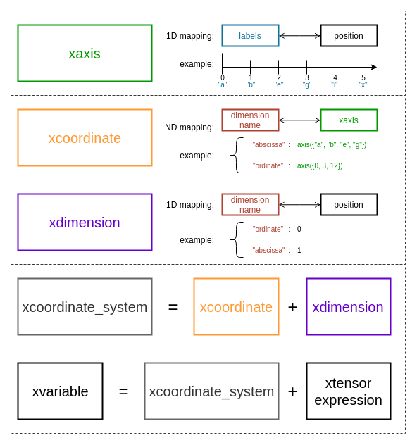

.. Copyright (c) 2018, Johan Mabille, Sylvain Corlay, Wolf Vollprecht
   and Martin Renou

   Distributed under the terms of the BSD 3-Clause License.

   The full license is in the file LICENSE, distributed with this software.

Data structures
===============

Axes
----

An axis is a mapping of labels to positions in a given dimension. It is the equivalent of
the ``index`` object from `pandas`_. `xframe` supports many types of labels, the most common
are strings, char, integers and dates. An axis is created from a list of labels, a builder
function is provided so the type of the axis can be inferred. The following example illustrates
the two main ways of creating an axis:

.. code::

    using saxis_type = xf::xaxis<xf::fstring, std::size_t>;

    saxis_type s1({ "a", "b", "d", "e" });
    auto s2 = xf::axis({ "a", "b", "d", "e" });
    // s1 and s2 are similar axes

It is also possible to create an axis given the size of the axis or the start, stop and step:

.. code::

    auto s3 = xf::axis(5);        // == xf::axis({ 0, 1, 2, 3, 4 });
    auto s4 = xf::axis(2, 7);     // == xf::axis({ 2, 3, 4, 5, 6 });
    auto s5 = xf::axis(0, 10, 2); // == xf::axis({ 0, 2, 4, 6, 8 });
    auto s6 = xf::axis("a", "d"); // == xf::axis({ "a", "b", "c" });

The axis API is similar to the one of a constant ``std::map`` that throws an exception when
asked a missing key:

.. code::

    std::size_t i0 = s1["a"];
    try
    {
        std::size_t i1 = s1["c"];
    }
    catch(std::exception& e)
    {
        // The exception will be catch since "c" is not a label of s1
        std::cout << e.what() << std::endl;
    }

``xaxis`` also provides iterators and methods to compute the union and the intersection of
axes. However a user rarely needs to manipulate the axes directly, the most common operation
is to create them and then store them in a coordinate system.

Coordinates
-----------

Coordinates are mappings of dimension names to axes. `xframe` provides different methods
to easily create them:

.. code::

    using coordinate_type = xf::xcoordinate<xf::fstring>;

    coordinate_type c1({{"group", xf::axis({"a", "b", "d", "e"})},
                        {"city",  xf::axis({"London", "Paris", "Brussels"})}});
    auto c2 = xf::coordinate({{"group", xf::axis({"a", "b", "d", "e"})},
                              {"city",  xf::axis({"London", "Paris", "Brussels"})}});
    // c1 and c2 are similar coordinates

.. note::

   The builder function ``xf::coordinate`` converts the ``const char*``
   arguments to ``fstring`` and returns a ``xcoordinate<fstring>`` object. You can modify
   this behavior by specifying the key type of the coordinate as the first template parameter
   of the ``coordinate`` function:
   ``auto c2 = xf::coordinate<std::string>({{"group", xf::axis({"a", "b", "d", "e"})}, ...});``

``xnamed_axis`` allows to store a dimension name - axis pair that you can reuse in different
coordinates objects; if you want to create a coordinate object from a named axis, all the
arguments must be named axes; fortunately, a ``xnamed_axis`` can be created in place, as
shown below:

.. code::

    // This object will be used in different coordinates objects
    auto a1 = xf::named_axis("igroup", xf::axis({1, 2, 4, 5})});

    auto c1 = xf::coordinate<xf::fstring>(a1, xf::named_axis("city", xf::axis({"London", "Parid", "Brussels"})));
    auto c2 = xf::coordinate<xf::fstring>(a1, xf::named_axis("country", xf::axis({"USA", "Japan"})));

As you can notice, coordinates objects can store axes with different label types. By default,
these types are ``int``, ``std::size_t``, ``char`` and ``xf::fstring``, you can
specify a different type list:

.. code::

    using coordinate_type = xf::xcoordinate<xf::fstring, xtl::mpl::vector<int, std::string>>;

    coordinate_type c({{"group", xf::axis({"a", "b", "d", "e"})},
                       {"city",  xf::axis({"London", "Paris", "Brussels"})}});

Dimension
---------

A dimension object is the mapping of the dimension names to the dimension positions in the
data tensor. Creating a ``xdimension`` is as simple as creating an ``xcoordinate`` or an
``xaxis``:

.. code::

    using dimension_type = xf::xdimension<xf::fstring>;

    dimension_type dim1({"city", "group"});
    auto dim2 = xf::dimension({"city", "group"});
    // dim1 and dim2 are similar dimensions

``xdimension`` provides an API similar to ``xaxis`` and therefore can be considered as a
special axis. Together a dimension object and a coordinate object form a coordinate system
which maps labels and dimension names to indexes in the data tensor.

.. note::

   Like ``xf::coordinate``, the builder function ``xf::dimension`` converts the ``const char*``
   arguments to ``fstring`` and returns a ``xdimension<fstring>`` object. You can modify
   this behavior by specifying the label type of the dimension as the first template parameter
   of the ``dimension`` function:
   ``auto d = xf::dimension<std::string>({"city", "group"});``

Variables
---------

A variable is a data tensor with a coordinate system, that is an ``xcoordinate`` object and
an ``xdimension`` object. It is the C++ equivalent of the ``xarray.DataArray`` Python class.
``xvariable`` provides many constructors:

.. code::

    using coordinate_type = xf::xcoordinate<xf::fstring>;
    using dimension_type = xf::xdimension<xf::fstring>;
    using variable_type = xvariable<double, coordinate_type>;

    data_type d = xt::eval(xt::random::rand({3, 4}));
    auto c = xf::coordinate({{"group", xf::axis({"a", "b", "d", "e"})},
                             {"city",  xf::axis({"London", "Paris", "Brussels"})}});
    auto dim = xf::dimension({"city", "group"});

    variable_type v1(d, c, dim);

    // Coordinates and dimension can be built in place
    variable_type v2(d, xf::coordinate({{"group", xf::axis({"a", "b", "d", "e"})},
                                        {"city",  xf::axis({"London", "Paris", "Brussels"})}}),
                        xf::dimension({"city", "group"}));

The data parameter can be omitted, in that case the variable creates an uninitialized data tensor:

.. code::

    variable_type v3(c, dim);

    variable_type v4(xf::coordinate({{"group", xf::axis({"a", "b", "d", "e"})},
                                     {"city",  xf::axis({"London", "Paris", "Brussels"})}}),
                     xf::dimension({"city", "group"}));

A variable can also be created from a map of axes and a list of dimension names:

.. code::

    variable_type::coordinate_map coord_map;
    coord_map["group"] = xf::axis({"a", "b", "d", "e"});
    coord_map["city"]  = xf::axis({"London", "Paris", "Brussels"});
    dimension_type::label_list dim_list = {"group", "city"};

    variable_type v5(d, coord_map, dim_list);
    variable_type v6(coord_map, dim_list);

If the dimension object is omitted, the dimension mapping is inferred from the coordinate
object. In the code below, the mapping is different from the previous defined variables,
``group`` is the name of the first dimension and ``city`` is the name of the second one:

.. code::

    variable_type v7(d, {{"group", xf::axis({"a", "b", "d", "e"})},
                         {"city",  xf::axis({"london", "Paris", "Brussels"})}});

    // variable with same coordinate system but uninitialized data
    variable_type v8({{"group", xf::axis({"a", "b", "d", "e"})},
                      {"city",  xf::axis({"london", "Paris", "Brussels"})}});

`xframe` also provides builder functions, so that the type of the variable can be inferred:

.. code::

    auto v10 = variable(d, c, dim);
    auto v11 = variable(d, xf::coordinate({{"group", xf::axis({"a", "b", "d", "e"})},
                                           {"city",  xf::axis({"London", "Paris", "Brussels"})}}),
                           xf::dimension({"city", "group"}));

    auto v12 = variable(c, dim);
    auto v13 = variable(xf::coordinate({{"group", xf::axis({"a", "b", "d", "e"})},
                                        {"city",  xf::axis({"London", "Paris", "Brussels"})}}),
                        xf::dimension({"city", "group"}));

Summary
-------

.. _pandas: https://pandas.pydata.org
